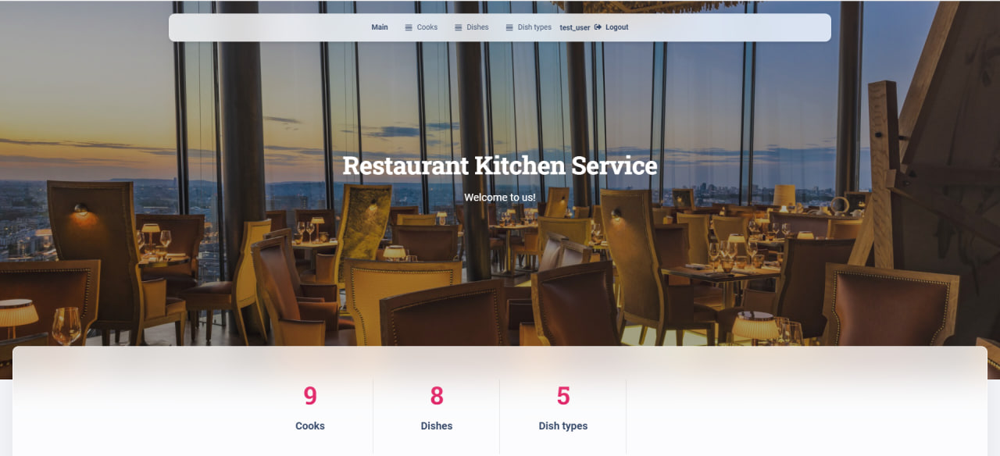

# Restaurant Kitchen Service

This application was created to improve communication and rules in the kitchen, as well as to help your cooks prepare dishes more efficiently and organized. With our system, cooks can create new dishes and dish types, as well as assign responsible cooks for cooking each dish. This will avoid misunderstandings and mistakes in the kitchen, as well as improve the quality of dishes.

## Check it out!

[Restaurant Kitchen Service project deployed to Render](https://restaurant-kitchen-service-esx6.onrender.com)

Use the following test user to log in and check the functionality of the website: 

```shell
login: test_user
password: test_password
```

## Installation 
Python3 must be already installed

```shell
git clone https://github.com/artur-leleiko/restaurant-kitchen-service
cd restaurant_kitchen_service
python3 -m venv venv
source venv/bin/activate  # on macOS
venv\Scripts\activate  # on Windows 
pip install -r requirements.txt
python manage.py migrate
python manage.py runserver #starts Django Server
```

## Features

* Authentication for User(Cook)
* Managing cooks, dishes and dish types directly from the website interface

## Demo

